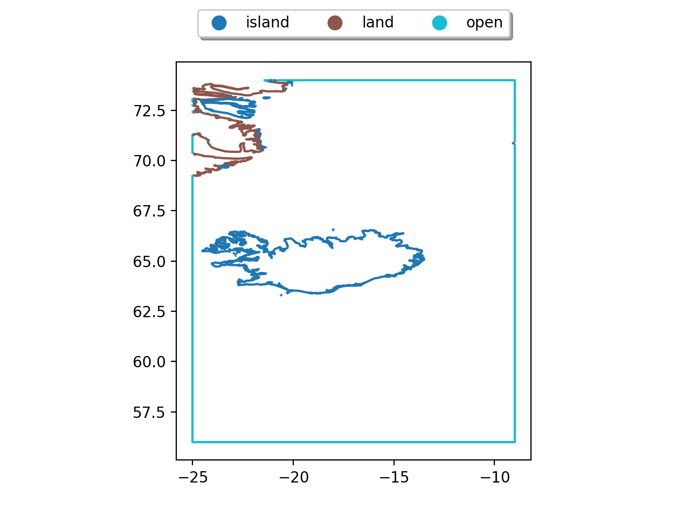
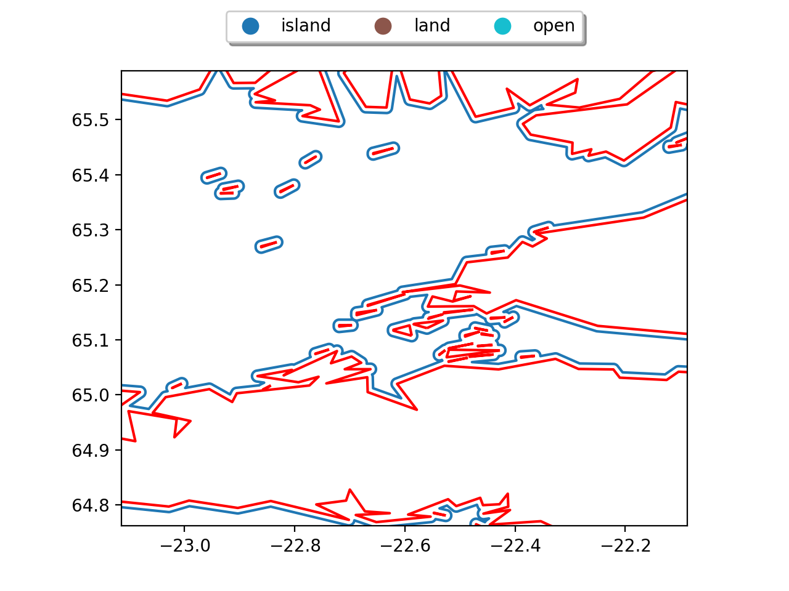

<style>body {text-align: justify}</style>

This module handles mesh boundary extraction from coastlines or user provided shapefiles. It underpins the [mesh](mesh.md) module.


Providing coastlines and a geometry definition, the module returns a `GeoDataFrame` with the corresponding boundary elements required for mesh generation and model construction. 


#### Example

- coastlines

```py
import geopandas as gp
# use cartopy to get coastlines
import cartopy.feature as cf

gi = cf.GSHHSFeature(scale="intermediate", levels=[1])
iGSHHS = gp.GeoDataFrame(geometry=[x for x in gi.geometries()])
```

- geometry 

```py
# define in a dictionary the properties of the model..
extend = {
    "lon_min": -25.0,  # lat/lon window
    "lon_max": -9.0,
    "lat_min": 56.0,
    "lat_max": 74.0,
}
```

Using the module as

```py
import pyposeidon.boundary as pb

a = pb.Boundary(geometry=extend, coastlines = iGSHHS)
```


the contours with their corresponding attributes are

```py
a.contours
											geometry	tag		lindex	nps
0	LINESTRING (-9.00000 70.88532, -9.01008 70.879...	land	1010	6
1	LINESTRING (-20.90062 74.00000, -20.83883 73.9...	land	1009	3
2	LINESTRING (-25.00000 73.62663, -24.94011 73.6...	land	1008	54
3	LINESTRING (-25.00000 73.46989, -24.99506 73.4...	land	1007	4
4	LINESTRING (-25.00000 73.09356, -24.91511 73.0...	land	1006	30
...	...	...	...	...
143	LINESTRING (-18.28925 63.53078, -18.28922 63.5...	island	-124	3
144	LINESTRING (-17.93172 63.54208, -17.99917 63.5...	island	-125	10
145	LINESTRING (-20.18253 63.46414, -20.18253 63.4...	island	-126	3
146	LINESTRING (-20.23919 63.42667, -20.27086 63.4...	island	-127	6
147	LINESTRING (-20.62086 63.30167, -20.62089 63.2...	island	-128	3
148 rows × 4 columns

```

and they can be visualized as 



#### Buffering 

Sometimes it is preferable to buffer the coastlines in order to mask high resolution features and smooth out the boundaries.

Setting

```py
b = pb.Boundary(geometry=window, coastlines=iGSHHS, cbuffer = .01)
```
!!! note

	The units of `cbuffer` are those of the coastlines.  

it can be seen that the boundaries are simplified accordingly 



where the new boundary is in `blue` and the old in `red`.