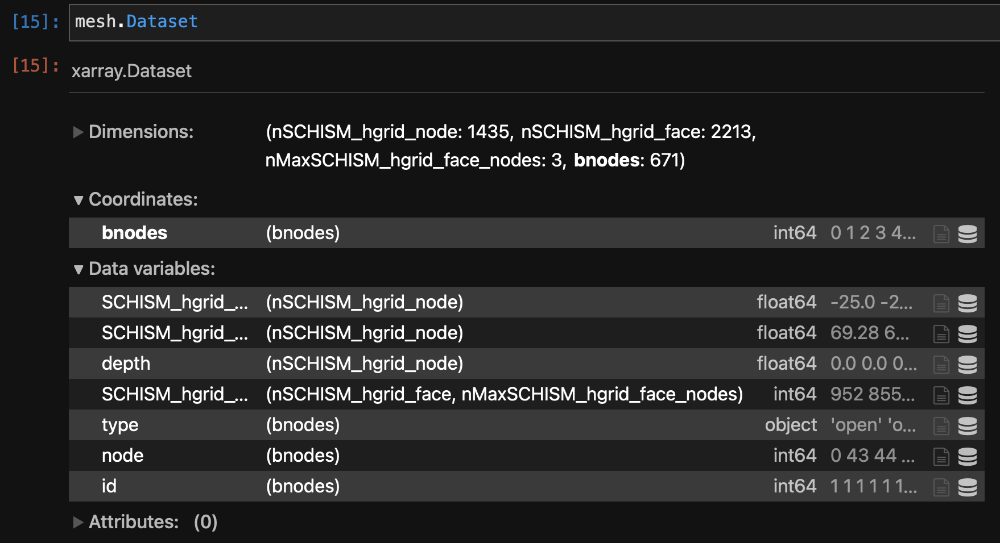
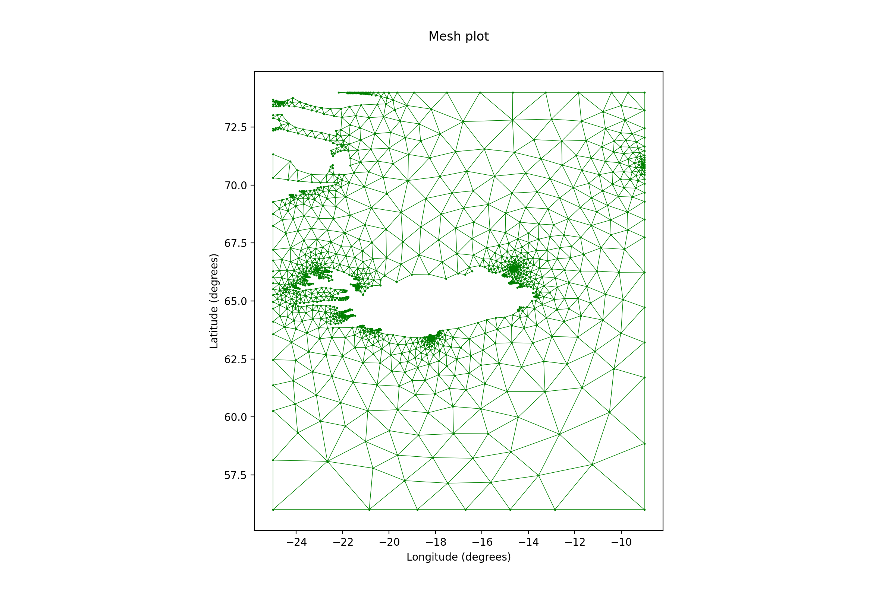
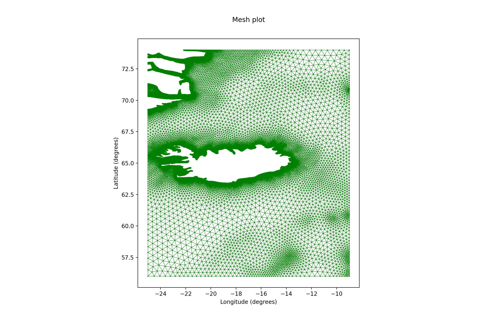

<style>body {text-align: justify}</style>

The Mesh module handles mesh creation/integration based on given boundaries.


### Setup

The minimum information required is the geometry's extent. In the most simple case that is a lat/lon box that defines the area of interest. Without loss of generality we select below Iceland as a test case.

In addition, the coastlines need to be provided as mesh boundaries.

We use the [GSHHG](http://www.soest.hawaii.edu/pwessel/gshhg/) dataset in the following example.


```python
# use cartopy to get coastlines
import cartopy.feature as cf
import geopandas as gp

gi = cf.GSHHSFeature(scale="intermediate", levels=[1])
iGSHHS = gp.GeoDataFrame(geometry=[x for x in gi.geometries()])

# define the geometry as dict
geometry = {
    "lon_min": -25.0,  # lat/lon window
    "lon_max": -9.0,
    "lat_min": 56.0,
    "lat_max": 74.0,
}
```

Additional required info include the type of mesh element (for now `r2d` or `tri2d` ) and the engine for the mesh generation (`jigsaw` or `gmsh`).

```py
import pyposeidon.mesh as pm

b = pm.set(
		type="tri2d",
		geometry=geometry,
		coastlines=iGSHHS,
		mesh_generator="jigsaw"
)
```

Note that the data structure used throughout `pyposeidon` is an `xarray` Dataset. Thus,



which can be visualised using the inherent accessors (see [utils](utils.md))) with 

```py
b.Dataset.pplot.mesh()
```



!!! note

	You can change the mesh generator above with mesh_generator = `gmsh`.


Better control on the mesh size can be obtained by providing a background control function usually in the form of a scaled DEM. One way to achieve this is to give as argument a dem file, like : 

```py
b = pm.set(
    type="tri2d",
    geometry=geometry,
    coastlines=iGSHHS,
    mesh_generator="jigsaw",
    dem_source="dem.nc",
    resolution_min=0.01,
    resolution_max=0.5,
)
```

which gives,



The output to a file, of type `hgrid` in this case, is done as

```py
b.to_file('/path/to/hgrid.gr3')
```

There is also a validator that checks whether the mesh works with `SCHISM`.

```py
b.validate(rpath='/path/to/folder/used/')
```

