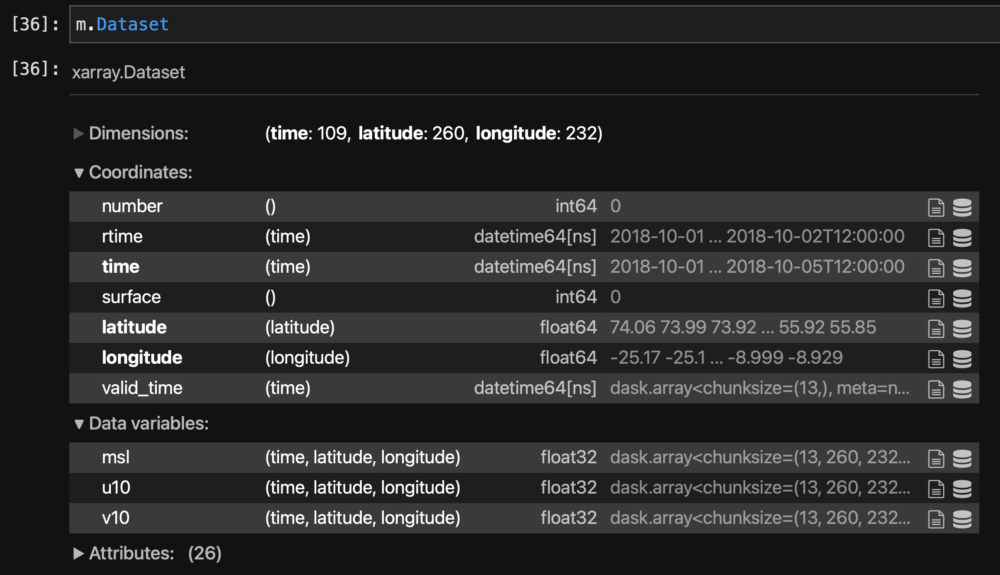
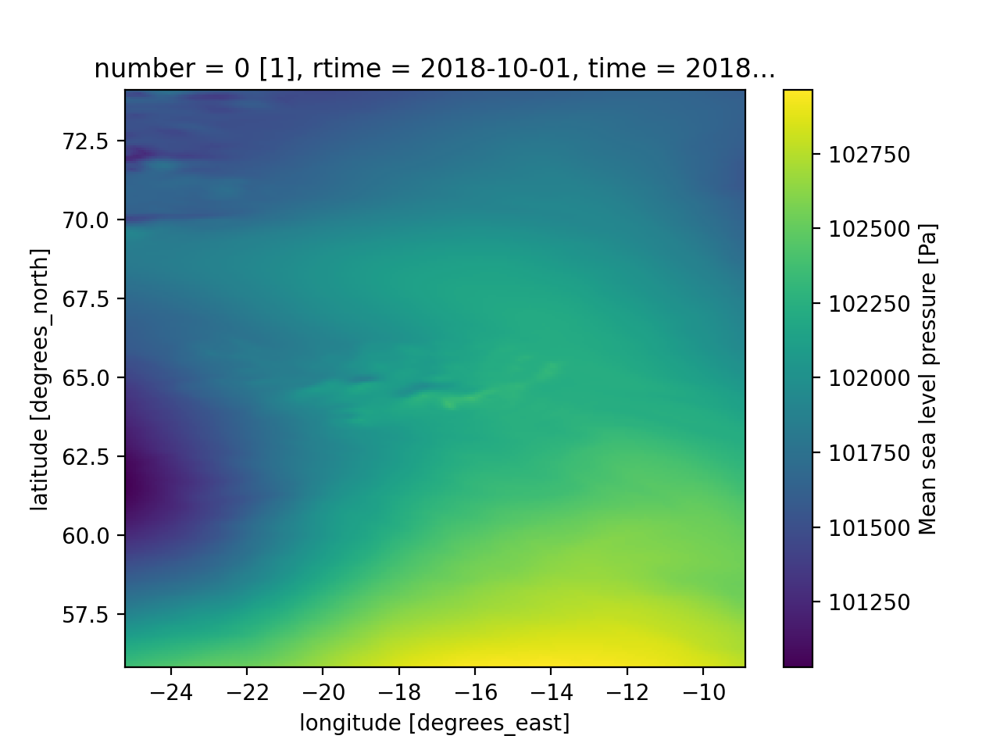

<style>body {text-align: justify}</style>

The meteo module handles the pre-processing of the atmospheric variables used as forcing in the model.


### Setup

- extent

In most cases, the geometry's extent is a `lat/lon` box that defines the area of interest. Otherwise the full dataset will be used. This might be problematic in large files e.g. global data especially when the file is retrieved from a url (see below).

Without loss of generality we select below *Iceland* as a test case.

```python
# define in a dictionary the properties of the model..
extend = {
    "lon_min": -25.0,  # lat/lon window
    "lon_max": -9.0,
    "lat_min": 56.0,
    "lat_max": 74.0,
}
```

- source

The Meteo class supports all the functionality of `xarray`. Thus the `meteo_source` argument can be:

#### Local file (or list of files) :

This could easily be defined as e.g.

```python
source = '/path/to/meteo.grib'
```
or 
```python
source = ['/path/to/meteo0.grib', '/path/to/meteo1.grib']
```

A number of formats are supported, namely `geotiff, grib, netcdf, zarr`, etc.

#### URL 

This usually means a link to an `opendap/erddap` server (supported through `pydap`). As an example, assuming that the source is the `GFS` data from `NOAA`, the link can be defined as:

```python
import pandas as pd
import numpy as np

start_date = pd.to_datetime("today") - pd.DateOffset(
    days=1
)  # step back one day for availability.

r = [0, 6, 12, 18]  # define a specific release

h = np.argmin(
    [n for n in [start_date.hour - x for x in r] if n > 0]
)  # find the latest available

url = (
    "https://nomads.ncep.noaa.gov/dods/gfs_0p25_1hr/gfs{}/gfs_0p25_1hr_{:0>2d}z".format(
        start_date.strftime("%Y%m%d"), r[h]
    )
)

source = url
```

!!! note

	This option would work only for small extents. For large areas (continental/global) using a previously locally stored file is advised. 

### Retrieve meteo Dataset

We can combine the info into a dictionary as

```python
dic = {"geometry":extend, "meteo_source":source}
```

and retrieve the Dataset with

```python
import pyposeidon.meteo as pm
m = pm.Meteo(**dic)
```



!!! note

	`xarray` is using `dask` for a lazy read and all data will be loaded into memory when needed. 

Visualisation is readily available through the plot accessor of `xarray`, e.g.

```python
m.Dataset.msl[0,:,:].plot() # A 2D graph for one timestep
```





### Output to file
 
Once the dataset is produced, it can be saved to files appropriate for the selected solver, e.g:

```python
m.Dataset.to_netcdf('./test/test.nc') # generic netCDF output

m.to_output(solver_name='d3d',rpath='./test/') # to u,v,p for D3D

m.to_output(solver_name='schism',rpath='./test/') # save to SCHISM hgrid format

m.to_output(solver_name='schism',rpath='./test/', meteo_split_by='day') # split into more files

m.to_output(solver_name='schism',rpath='./test/', m_index=2) # Define index for meteo (for SCHISM)
```

