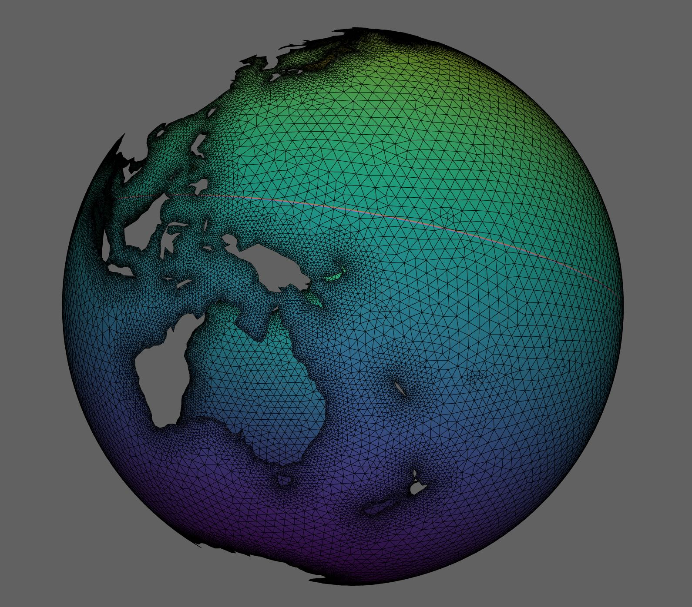
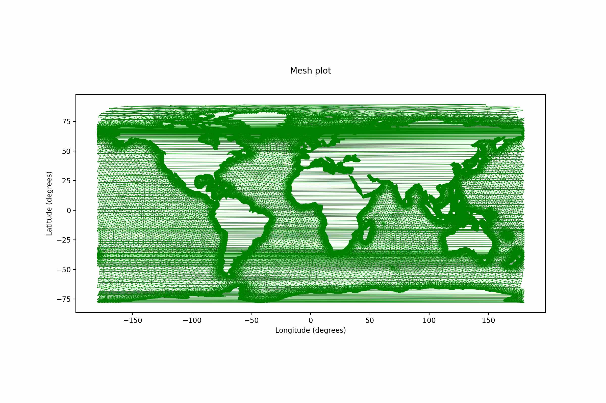
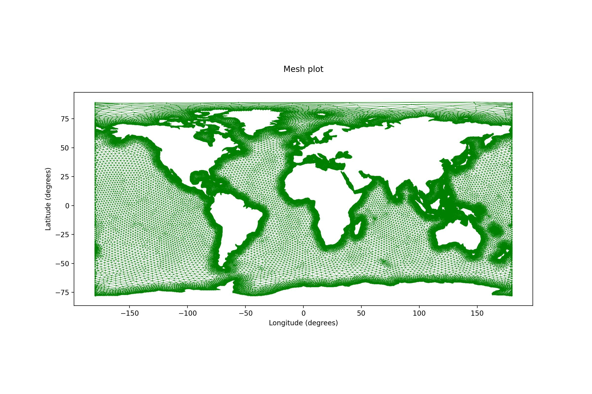
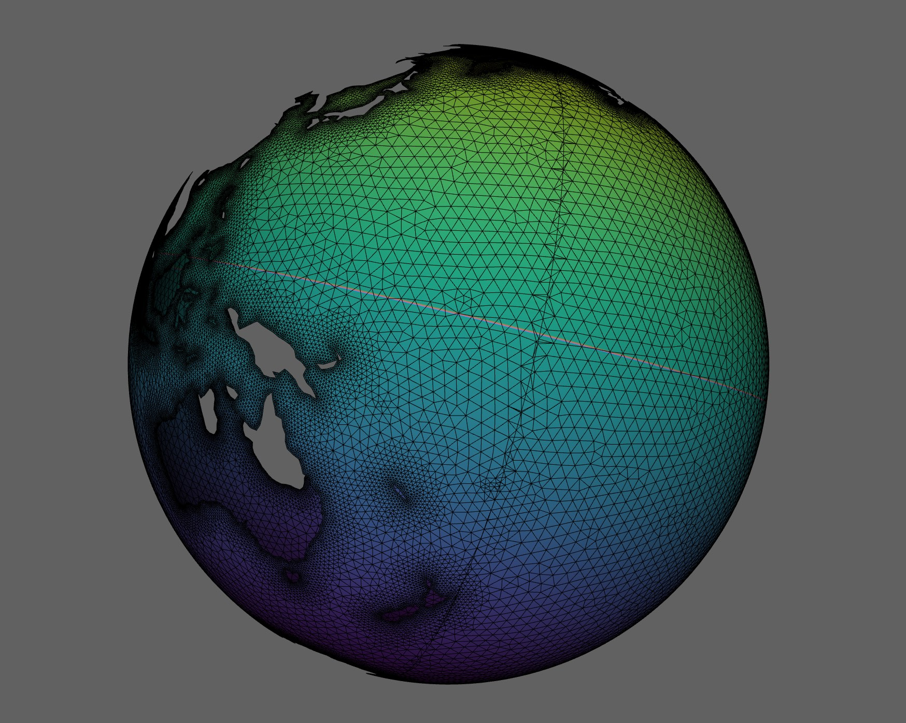
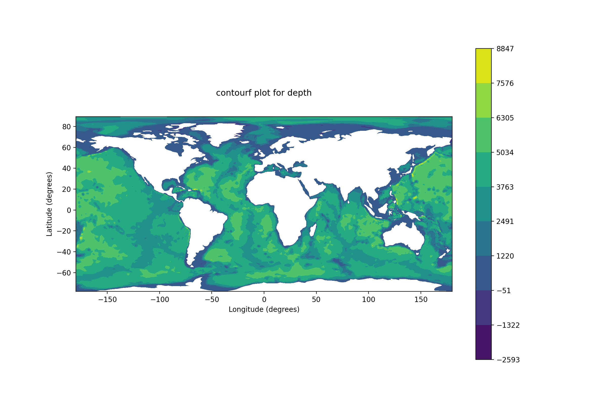

<style>body {text-align: justify}</style>

A number of utilities is included within `pyposeidon` providing useful functionality.

### pplot

Datasets that represent unstructured models, namely those with `schism` can be visualised using `matplotlib` as follows. 

Assuming `g` is an output Dataset (see [model](model.md)) the available functions are:

```py
#mesh depiction using `plt.triplot`.
g.pplot.mesh() 

# variable map using `plt.tricontourf`. 
g.pplot.contourf(var='depth') 

# variable map using `plt.tricontour`. 
g.pplot.contour(var='depth') 

#vectors using `plt.quiver`. 
g.pplot.quiver(it = 2, u=out.hvel.values[2,:,0,0],v=out.hvel.values[2,:,0,1],
 				scale=.05, title='hvel', color='k') 

# animate with `matplotlib.animation`.				
g.pplot.frames(var='elev',title='SSH') 
 
g.pplot.qframes(u=g.hvel.values[:,:,0,0],v=g.hvel.values[:,:,0,1],
 				title='Vel',scale=.05, color='k')	
```


### hplot

Similar functionality is available using [hvplot](https://hvplot.holoviz.org).

```py
g.hplot.mesh() #mesh depiction using `gv.TriMesh`.
 
g.hplot.contourf(var='depth') # variable map using `gv.TriMesh`.
 				
g.pplot.frames(var='elev',title='SSH') # animate with `hv.DynamicMap`.
 
```

### mplot

Yet another backend for visualising using `VTK`. Currently [mayavi](https://docs.enthought.com/mayavi/mayavi/) is used for producing the graphs. This provides also 3D plotting capabilities.

```py
g.mplot.mesh(dim='3D') #mesh depiction using `mlab.triangular_mesh`.
 
g.mplot.contourf(var='depth') # variable map using `mlab.triangular_mesh`. 
```


### seam.

When working with a global mesh, the 2D representation of the data is problematic.

So this mesh 



in 2D will have artefacts due to cross over elements...





However, using the corresponding utility from `pyposeidon`, a seam can be created on the international time line, mitigating the problem.

```python
from pyposeidon.utils.seam import get_seam

xn,yn,tri3n= get_seam(x,y,None,tri3) # get new arrays 

```

where `x,y,tri3` are the original node coordinates and tessellation.

These new arrays can be used to plot the mesh in 2D without problems,




The creation of the seam can be seen better in 3D.




Evaluating any variable in the new adjusted topology becomes:

```py
from pyposeidon.utils.seam import to_2d

bathymetry = to_2d(Dataset,var='depth', mesh=[xn,yn,tri3n])
```




### cast

Any long-time simulation can be performed in several steps. This is true for long hindcasts as well as forecasts. The `cast` utility can then be used as:

```py
from pyposeidon.utils import cast

# folder for the new run hotstarting from the original folder
new_path = '/path/to/new/run'
# new meteo file
mf = 'path/to/new/meteo/file'

rs = cast.set(solver_name='schism',
        model=b, #reference model, could be instance or json file
        ppath=b.rpath, #original path
        cpath=new_path, #new path
        meteo=mf, #new meteo
        sdate=b.date + pd.DateOffset(hours=12) #new start time
) 

rs.run(execute=True)

``` 

